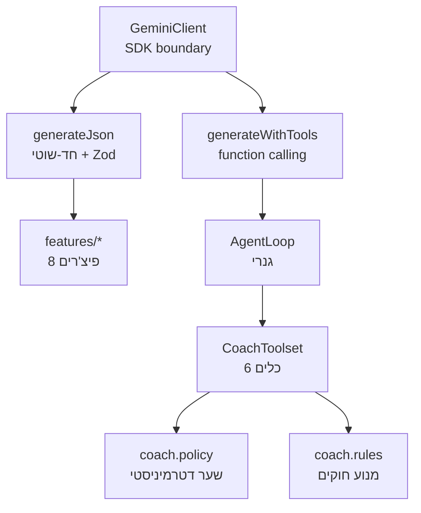

# שכבת ה-AI ב-HabitFlow

## 1. תמונת על: שלושה נתיבים, גבול אחד

כל קריאה למודל עוברת דרך נקודה אחת — `apps/backend/src/ai/gemini.client.ts`. מעליה יש שלושה נתיבים שונים לגמרי:



ההבחנה המרכזית: **נתיב B הוא "שאלה אחת → JSON מובנה", נתיב C הוא "שיחה → המודל בוחר מה לשלוף"**.

---

## 2. שכבת הגבול — `GeminiClient`

`apps/backend/src/ai/gemini.client.ts` הוא הקובץ היחיד שמכיר את ה-SDK של `@google/genai`. הוא נותן שלושה דברים:

**א. שרשרת fallback על מודלים** — `withModelFallback<T>` מנסה `gemini-3.5-flash-lite` → `gemini-flash-lite-latest` → `gemini-2.5-flash`. כשל בכל השלושה = `InternalServerErrorException` עם הודעה ידידותית. `GEMINI_MODEL` ב-`.env` דורס את כל השרשרת (שימושי לבדיקת fallback).

**ב. `generateJson<T>(prompt, schema)`** — שולח עם `responseMimeType: 'application/json'`, מפרסר, ואז **מאמת מול סכמת Zod**. פלט שלא עובר ולידציה נזרק — הוא לא מגיע לשאר המערכת. זה המנגנון שמונע מהמודל להחזיר שדות שהאפליקציה לא מצפה להם.

**ג. `generateWithTools({systemInstruction, contents, functionDeclarations})`** — מחזיר `{text, toolCalls}`.

שתי מלכודות אמיתיות שמקודדות שם:

- `responseMimeType: 'application/json'` ו-`tools` **הדדית סותרים** בגרסה 0.14.1 — לכן נתיב הכלים לא מבקש JSON.
- `FunctionCall.name` הוא **אופציונלי** בטיפוסים, ולכן יש `.filter(call => Boolean(call.name))`. הסרה שלו שוברת קומפילציה.

---

## 3. נתיב B — שמונה פיצ'רים חד-שוטיים

כל פיצ'ר בנוי מאותה שלישייה: `prompts/x.prompt.ts` (בניית הטקסט) + `schemas/x.schema.ts` (חוזה Zod) + `features/x.feature.ts` (התזמור). `AiService` הוא רק facade דק שמנתב.

| פיצ'ר | מה עושה | לוגיקה מעניינת |
|---|---|---|
| `persona-classifier` | ממפה 6 תשובות פתוחות + מטרה ל-persona | מוודא **בדיוק** 6 תשובות לפני שמבזבז קריאה |
| `persona-drift-detector` | האם ה-persona עדיין מתאים | **המודל רק מדרג pillars — הקוד מחשב את הדריפט** |
| `portfolio-generator` | בונה תיק מטרות ראשוני | – |
| `daily-motivation` | הודעת בוקר | cache לפי `userId\|date\|persona` |
| `habit-insights` | תובנות שבועיות | cache לפי שבוע ISO |
| `coach-phrasing` | מנסח מחדש הודעת תבנית | **fallback ל-`baseMessage` המקורי** |
| `habit-goal-relevance` | האם ההרגל קשור למטרה | fallback `isRelated: true` |
| `task-verification` | האם ההערה סבירה | fallback `isPlausible: true` |

### שני דפוסים ששווה לשים לב אליהם

**`persona-drift-detector` — המודל לא מחליט.** המודל מחזיר רק `currentBreakdown` (ציוני pillars). את הדריפט מחשב הקוד: **Total Variation Distance** בין ההתפלגות הבסיסית לנוכחית —

$$d_{TV} = \frac{1}{2}\sum_{p \in \text{Pillars}} \left| \hat{b}_p - \hat{c}_p \right|$$

ומשווה ל-`DRIFT_THRESHOLD = 0.3`. גם ה-persona הדומיננטי נגזר בקוד (`argmax`). זו ההפרדה הדטרמיניסטית בגרסתה הראשונה.

**Fail-open מכוון.** שלושת הפיצ'רים הבודקים (`task-verification`, `habit-goal-relevance`, `coach-phrasing`) חוזרים לערך מתירני כשהמודל נופל. ההיגיון: תקלת AI לא אמורה לחסום משתמש מלסמן הרגל. לעומת זאת `persona-classifier` **כן** נכשל בקול — שם אין ברירת מחדל שפויה.

---

## 4. נתיב C — ה-Agent Loop

### 4.1 חוזה הכלי

`apps/backend/src/ai/agent/agent-tool.ts` — 44 שורות, אפס ידע דומייני:

```ts
defineTool<TArgs>({ name, description, parameters, argsSchema, execute })
```

`parameters` הוא ה-`Schema` שהמודל רואה; `argsSchema` הוא Zod שמאמת את מה שהמודל **באמת** שלח לפני ש-`execute` רץ. שתי שכבות, כי המודל לא תמיד מכבד את ה-schema שהוצג לו.

שלוש שגיאות מובחנות:

- `InvalidToolArgumentsError` — ארגומנטים פסולים
- `ToolRejectedError` — **סירוב מכוון**; ההודעה מוצגת למודל מילה במילה
- כל שאר — קריסה אמיתית

ההבחנה בין השנייה לשלישית היא מה שמאפשר למודל להגיב אחרת ל"אסור לך" מאשר ל"משהו נשבר".

### 4.2 הלולאה

`apps/backend/src/ai/agent/agent-loop.ts` — עד `DEFAULT_MAX_STEPS = 5` איטרציות:

1. בונה `Content[]` מהיסטוריה + ההודעה
2. קורא ל-`generateWithTools`
3. **אין קריאות כלים → זו התשובה, יוצאים**
4. יש קריאות → דוחף תור `model` עם `functionCall` parts, מריץ, דוחף תור `user` עם `functionResponse` parts
5. חוזר

בחריגה ממכסת הצעדים — קריאה אחרונה עם `functionDeclarations: []`, שמאלצת טקסט. זה מונע מצב של "הסוכן נתקע בלולאה ולא ענה".

כל תוצאה נעטפת כ-`{ output: ... }` כי `functionResponse.response` **חייב** להיות אובייקט JSON.

---

## 5. שכבת הדומיין של הקואצ'ר

### 5.1 ששת הכלים

`apps/backend/src/coach/coach.toolset.ts` פותח **סשן לכל שיחה** עם state סגור (`{drift, staged}`) — כך שכלי אחד יכול לזכור מה כלי אחר עשה, בלי state גלובלי.

| כלי | מחזיר | הגבול שלו |
|---|---|---|
| `get_progress_summary` | rate, streak, **band, verdict** | "רק נסח מחדש, אל תחשב מחדש" |
| `get_habit_list` | שורה לכל הרגל | "אל תשפוט לפיו התקדמות כללית" |
| `get_persona_profile` | ה-persona **המאוחסן** | "האם עדיין מתאים — זו שאלה של check_persona_drift" |
| `get_active_goal` | id + targetDate, או `null` | "העתק את ה-id מילה במילה" |
| `check_persona_drift` | דריפט + persona מוצע | יקר, **cache לסשן**, חובה לפני switch |
| `propose_change` | staging בלבד | עובר דרך שער המדיניות |

התיאורים ארוכים בכוונה — כל תיאור אומר *מתי* לקרוא, ו*איזה כלי אח* להעדיף במקום. זה מה שמונע חפיפה ובלבול (בעבר זה היה כלי אחד, `get_habit_overview`, שעשה גם וגם).

### 5.2 שער המדיניות — `coach.policy.ts`

`apps/backend/src/coach/coach.policy.ts` הוא **פונקציה טהורה**: `rejectionReason(change, context) → string | null`. אין בו NestJS, אין בו IO, אין בו מודל.

ארבע משפחות דחייה:

```
alreadyStaged        → הצעה אחת לשיחה
personaSwitch        → חייב drift שנבדק, שזוהה, ושמצביע בדיוק על ה-persona הזה
adjustDifficulty     → increase דורש ≥80% | decrease רק מתחת ל-50%
forfeitGoal          → goalId חייב להתאים לפעיל, וההרגלים חייבים להיות בכשל מתמשך
```

`isGoalFailing` דורש **גם** שכל ההרגלים ב-streak 0 **וגם** consistency ממוצע מתחת ל-`0.3`. תנאי כפול, כדי שוויתור על מטרה לא יוצע בקלות.

הנקודה הקריטית: המודל **לא יכול לעקוף את זה**. גם אם הוא משוכנע, `propose_change` יזרוק `ProposalRejectedError` והסיבה תחזור אליו כטקסט — והוא מונחה לומר למשתמש בכנות מה המספרים מראים.

### 5.3 מנוע החוקים — `coach.rules.ts`

זה מה ש**נשאר מחוץ למודל לחלוטין**:

- `computeStats` — חלון 7 ימים, `completionRate7d = completions / (habitCount × 7)`
- `pickBand` — ספים קשיחים: `≥0.8 EXCELLENT`, `≥0.5 GOOD`, `≥0.2 SLIPPING`, אחרת `AT_RISK`
- `pickTip` — **הסדר משמעותי**: `streak === 0` מנצח לפני בדיקות ה-rate
- `weeklySummary` / `dailySummary` — הרכבת משפטי תבנית

המודל מקבל את ה-`band` ואת ה-`verdict` **מוכנים**. אם מישהו בעתיד ישנה את `get_progress_summary` להחזיר רק מספרים גולמיים — ההפרדה הדטרמיניסטית נעלמת.

---

## 6. סולם הפולבאק — שלושה שלבים

זה החלק שמבדיל בין "בוט שנשבר" ל"בוט שממשיך לתפקד":

| שלב | טריגר | תוצאה |
|---|---|---|
| 1 | מודל אחד נפל | מודל הבא בשרשרת (`withModelFallback`) |
| 2 | כל המודלים נפלו / טקסט ריק | `COACH_UNAVAILABLE` + `weeklySummary` אמיתי מה-DB |
| 3 | גם ה-DB לא זמין | `COACH_OFFLINE_REPLY` |

שלב 2 הוא העיקר: המשתמש מקבל **קואצ'ינג אמיתי** — ה-band שלו, שורת ה-persona, וטיפ — רק בלי ניסוח חופשי. ב-`coach.agent.ts` הצעה שהוכנה **נזרקת** בפולבאק, כי התשובה שהייתה אמורה להסביר אותה מעולם לא הגיעה למשתמש.

`CoachAgent` מחזיר גם `fellBack: boolean` ו-`toolsUsed: string[]` — שקיפות תפעולית.

---

## 7. אבטחה

`apps/backend/src/ai/prompts/safety.ts` — `PROMPT_SAFETY_GUARDRAIL` מוזרק לכל prompt. שני סעיפים:

1. **הגנת prompt injection** — טקסט משתמש (מטרות, תשובות, שמות הרגלים) מטופל כ**נתונים בלבד**. הוראות שמוטמעות בו מתעלמים מהן.
2. **הוגנות** — איסור מפורש להסיק מגדר/גיל/אתניות/דת/מוגבלות/בריאות.

בנוסף, שכבות ההגנה הטכניות: ולידציית Zod על כל פלט, `MAX_REPLY_LENGTH = 1000`, ו-`userId` **לעולם לא מגיע מהמודל** — הוא נסגר ב-closure ב-`toolset.open(userId)`, כך שהמודל לא יכול לבקש נתונים של משתמש אחר. זו הגנת IDOR מבנית, לא הצהרתית.

---

## 8. מה מאומת ומה לא

**מאומת:** 437 טסטים, 32 suites. הלולאה נבדקת מול `GeminiClient` ממוקק — כלי לא מוכר, ארגומנטים פסולים, כלי שזורק, מכסת צעדים, סדר היסטוריה. המדיניות נבדקת כולל גבולות מדויקים ב-0.8 ו-0.5.

**לא מאומת:** אף קריאה אמיתית ל-function calling של Gemini לא בוצעה. כל הטסטים ממקקים את `generateWithTools`.

---

## 9. נקודת התורפה האדריכלית

שני הנתיבים חיים זה לצד זה: `features/*` הוא "prompt אחד → JSON", `agent/*` הוא "שיחה → כלים". `persona-drift-detector` נמצא בנתיב הראשון אבל **נצרך** על ידי השני דרך `check_persona_drift` → `PersonasService.driftCheck`. כלומר יש כאן קריאת AI מקוננת: הסוכן קורא לכלי, שקורא לפיצ'ר, שקורא למודל. זה עובד, אבל זה מסביר למה `check_persona_drift` מתויג "expensive" ו-cache-ד לסשן — בלי ה-cache, שיחה אחת יכולה לייצר מספר קריאות drift מלאות.
